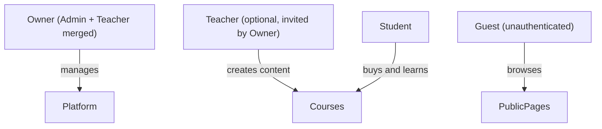
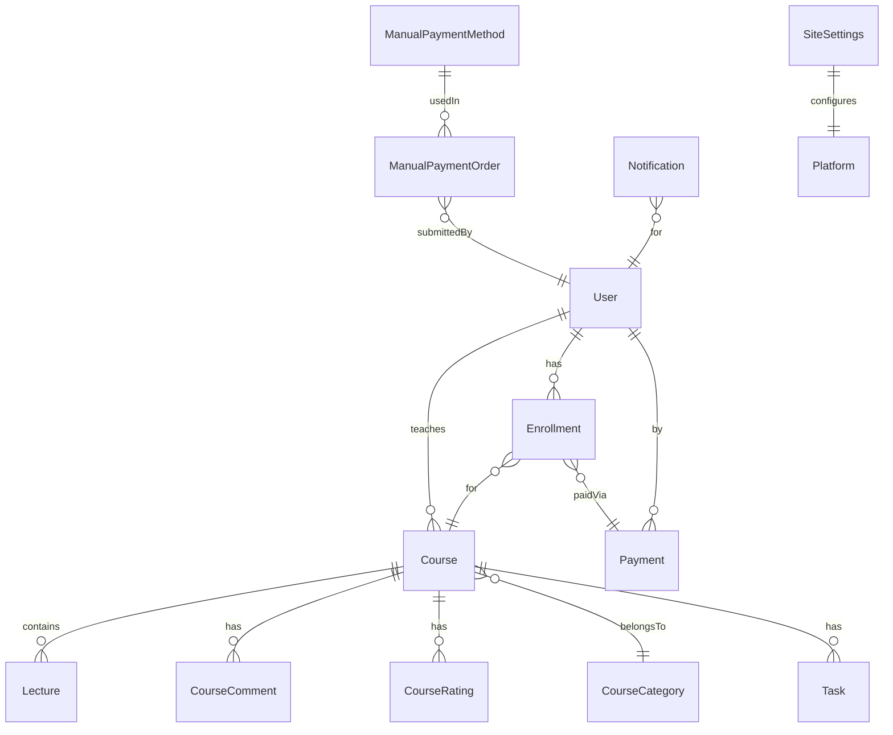

# LMS App Restructure — Final Product Structure

## Product Identity (Revised)

**What it is:** A branded online academy platform that a training business owner deploys, brands, and uses to sell and deliver courses to their students.

**Who buys it:** A solo educator, coach, or small training center owner in the Arabic-speaking market.

**How you sell it:** One-time sale (deployed + handed over) or licensed. Not a multi-tenant SaaS you operate yourself.

---

## Role Structure (Simplified)

Current roles: Guest, Student, Teacher, Admin (4 roles with complex governance between them).

**New structure: 3 roles**

- **Owner**: The person who bought the platform. Has full control — creates courses, manages students, sees revenue, configures settings. No "submit for review" flow; they publish directly.
- **Teacher** (optional): If the owner has 1-2 instructors, they can invite them. Teachers create courses and see their own students. No "request to become teacher" public flow.
- **Student**: Buys courses, watches lectures, submits tasks, gets certificates.
- **Guest**: Sees public pages, course catalog, signs up.

---

## Feature Decisions

### KEEP (core product — polish these)

| Area              | Features                                                                                |
| ----------------- | --------------------------------------------------------------------------------------- |
| Auth              | Email/password, Google sign-in, email verification, password reset                      |
| Course Management | Create/edit course, add lectures, organize by category, publish directly                |
| Learning Delivery | Lecture player (video via Vimeo/Cloudinary), student workspace, progress tracking       |
| Assessments       | Task/assignment creation, student file submission                                       |
| Commerce          | Manual payment (bank transfer/proof upload) — this is your Arabic market killer feature |
| Commerce          | Stripe checkout (optional, for owners who want card payments)                           |
| Enrollment        | Payment-gated access, enrollment state                                                  |
| Public Pages      | Home, About, Course catalog, Course detail page                                         |
| Branding          | Owner can customize logo, colors, hero text, about page, "Why Learn" section from admin |
| Certificates      | Generate certificate on course completion                                               |
| Ratings/Comments  | Students can rate and comment on courses (social proof)                                 |
| Notifications     | Simple in-app notifications                                                             |
| Admin Basics      | See enrolled students, see revenue summary, manage manual payment orders                |

### SIMPLIFY (reduce to minimal viable version)

| Feature                 | Current State                                              | Simplified To                                                          |
| ----------------------- | ---------------------------------------------------------- | ---------------------------------------------------------------------- |
| Refunds                 | Full refund policy engine + request processing + audit log | Single "Approve/Reject refund" button on enrollment. No policy editor. |
| Admin Finance           | Complex dashboards, CSV exports, chargeback pages          | One "Revenue" page: total earned, recent payments list. That's it.     |
| Teacher governance      | Public "become a teacher" request + admin approval flow    | Owner invites teachers via email from settings. No public request.     |
| Course review lifecycle | Teacher submits -> Admin reviews -> publishes              | Owner/Teacher clicks "Publish." Done.                                  |
| Announcements           | Broadcasting system to cohorts                             | Simple "send notification to all students of course X" — one form.     |

### REMOVE (defer entirely, hide from UI)

- **Chargeback/dispute system** — files: `chargeback.controller.js`, `chargeback.model.js`, `chargeback.route.js`, `chargebackEvidence.service.js`, `chargebackPdf.js`, admin chargeback pages
- **Complex refund audit log** — `refundAuditLog.model.js` (keep basic refund approve/reject only)
- **"Become a teacher" public request flow** — remove from public UI, replace with invite-only
- **Admin CSV export system** — `adminExport.controller.js`, `ExportCsvButton.jsx` (defer)
- **Money-back guarantee policy engine** — `MoneyBackGuaranteeForm.jsx`, `RefundPolicyForm.jsx`
- **Stripe webhook chargeback handling** — simplify webhook to only handle payment success

---

## App Page Structure (Final)

### Public (Guest/Unauthenticated)

- `/` — Home (hero, featured courses, why learn, branding)
- `/about` — About page
- `/courses` — Course catalog (browse by category)
- `/courses/:id` — Course public page (description, rating, price, enroll button)
- `/teacher/:id` — Public instructor profile
- `/login` — Login
- `/signup` — Sign up
- `/forgot-password` — Password reset flow
- `/verify-email` — Email verification

### Student (Authenticated)

- `/my-courses` — Enrolled courses dashboard
- `/courses/:id/learn` — Course workspace (lectures, progress, tasks)
- `/courses/:id/learn/task/:taskId` — Task submission page
- `/payment/:courseId` — Checkout (Stripe or manual)
- `/payment/success` — Payment confirmation
- `/my-payments` — Payment history + manual payment status
- `/notifications` — Notifications
- `/profile` — Edit profile
- `/refund/:enrollmentId` — Request refund (simple form)

### Owner/Admin Dashboard

- `/admin` — Dashboard (students count, courses count, revenue this month)
- `/admin/courses` — All courses (manage, publish/unpublish)
- `/admin/courses/:id` — Course detail (students, revenue for this course)
- `/admin/students` — All students list
- `/admin/students/:id` — Student detail
- `/admin/payments` — All payments (Stripe + manual) — simple list
- `/admin/manual-payments` — Pending manual payment approvals
- `/admin/refunds` — Refund requests (approve/reject)
- `/admin/settings` — Platform branding, payment methods config
- `/admin/teachers` — Invite/manage teachers (if multi-teacher)

### Teacher (if separate from Owner)

- `/teaching/courses` — My courses
- `/teaching/courses/:id` — Course management (lectures, tasks, students)
- `/teaching/courses/:id/create-lecture` — Add lecture
- `/teaching/courses/:id/create-task` — Add task

---

## Database Models (Keep)

**Keep:** User, Course, Lecture, Enrollment, Payment, CourseCategory, CourseComment, CourseRating, Task, ManualPaymentMethod, ManualPaymentOrder, Notification, SiteSettings

**Remove/Defer:** Chargeback, RefundAuditLog, UserSession (unless needed for security)

**Simplify:** RefundRequest — can be a status field on Enrollment (`refundRequested`, `refundApproved`, `refundRejected`) rather than a full separate model.

---

## One-Month Timeline

- **Week 1**: Strip removed features from UI (hide pages/routes, don't delete backend code yet). Merge Admin+Teacher experience for the Owner role. Remove "become a teacher" public flow, remove chargeback pages, remove complex refund UI.
- **Week 2**: Polish the student journey — course catalog, checkout (manual + Stripe), learning workspace, task submission, certificate. This is what the buyer demos to THEIR clients.
- **Week 3**: Polish the Owner dashboard — simple revenue view, manual payment approvals, student management, branding settings. Make it feel clean and non-overwhelming.
- **Week 4**: Deploy a demo instance, test the full flow end-to-end, fix bugs, prepare a 2-minute Arabic video walkthrough for selling.

---

## Key Principle

Every screen in the app should pass this test: **"Would a non-technical training center owner in Cairo/Riyadh unnderstand this page in 5 seconds?"** If not, simplify it or remove it.