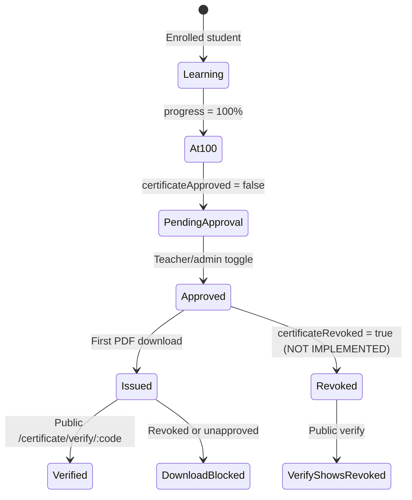
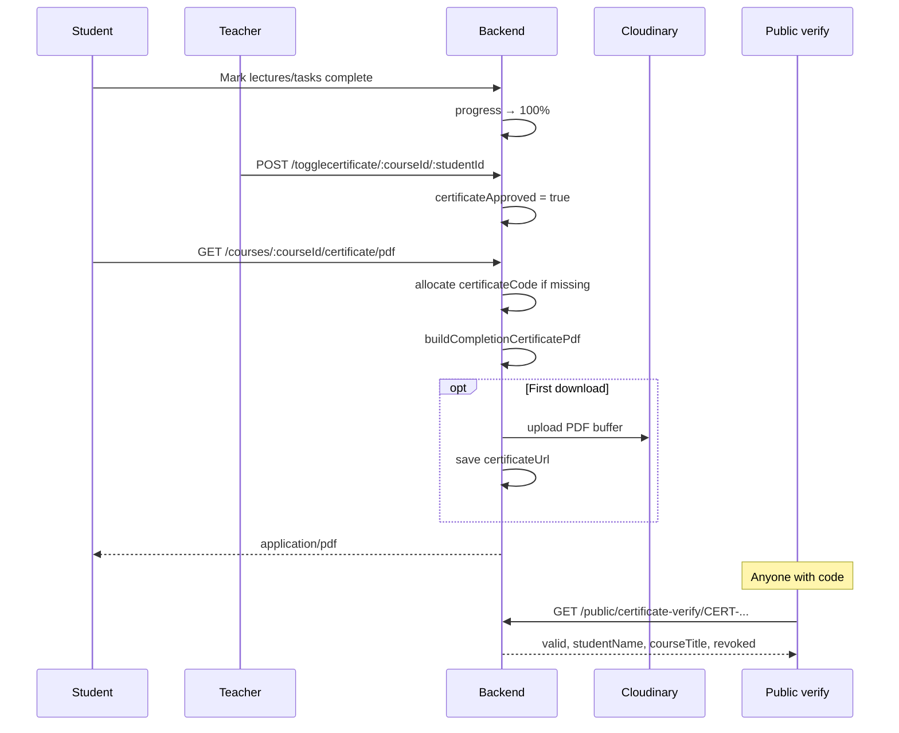
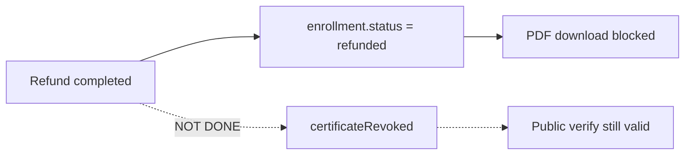

# Production Recommendations — Certificates & Credentials

> **Related:** [Index](./production-recommendations-index.md) · [Auth](./production-recommendations.md) · [Payments](./production-recommendations-payment.md) · [Content access](./production-recommendations-content-access.md) · [Uploads](./production-recommendations-uploads-media.md)

**Scope:** Course completion certificates — approval workflow, PDF generation, Cloudinary storage, public verification, admin branding, and frontend download UX.  
**Date:** 2026-05-30  
**Verdict:** The **credential design is sensible** (teacher approval + 100% gate + public verify code). **Revocation is unfinished**, approval rules are **only partially enforced server-side**, and **refunds do not invalidate certificates**.

---

## Executive summary

| Area | Status | Summary |
|------|--------|---------|
| Approval before download | ✅ Keep | `certificateApproved` + 100% progress required on PDF route |
| Opaque verify codes | ✅ Keep | `CERT-` + 20 hex chars; unique sparse index |
| Public verification page | ✅ Keep | No auth; shows revoked state |
| Admin certificate branding | ✅ Keep | Site settings + URL validation on patch |
| Revocation | ❌ Missing | Fields exist; no API or refund hook sets them |
| Approval API hardening | ⚠️ Update | Toggle lacks server-side 100% / enrollment checks |
| Progress integrity | ⚠️ Update | Depends on self-reported progress (see content-access doc) |
| PDF / Cloudinary lifecycle | ⚠️ Update | Stored URL can drift from regenerated PDF |
| SSRF on logo fetch | ⚠️ Update | Server fetches arbitrary admin-configured image URLs |

**Blockers before production launch:** implement revocation (or remove verify for refunded learners), enforce approval rules on `toggleCertificatePermission`, tie refund → credential invalidation.

---

## Credential lifecycle



| Stage | Storage | Who acts |
|-------|---------|----------|
| Progress | `CourseCompletion.progress` | Student (mark complete) |
| Approval | `CourseCompletion.certificateApproved` | Teacher/admin `POST /togglecertificate/...` |
| Issue | `certificateCode`, `certificateIssuedAt`, optional `certificateUrl` | First `GET .../certificate/pdf` |
| Verify | Public `GET /api/public/certificate-verify/:code` | Anyone |

---

## What to KEEP (do not rewrite)

### 1. Gated PDF download

`downloadCourseCertificatePdf` requires:

- Auth + role-appropriate access
- Student: active enrollment
- `certificateApproved === true`
- `progress >= 100%`
- `certificateRevoked !== true`

**File:** `backend/src/controllers/certificate.controller.js`

### 2. Cryptographic-style credential IDs

```js
CERT-${crypto.randomBytes(10).toHex().toUpperCase()}  // 20 hex chars
```

Collision handling via `allocateUniqueCertificateCode()` (up to 8 retries).

**File:** `backend/src/services/certificatePdf.service.js`

### 3. Unique indexes on completion records

- `{ student, course }` unique — one completion row per learner per course
- `certificateCode` sparse unique — verify lookup

**File:** `backend/src/models/courseCompletion.model.js`

### 4. Public verify without leaking existence timing

Invalid format → `{ valid: false }` (200). Unknown code → `{ valid: false }`. Revoked → `{ valid: true, revoked: true }`.

**Files:** `certificate.controller.js`, `CertificateVerifyPage.jsx`

### 5. Branding from site settings

Issuer legal name, tagline, logo URL, signature image, signatory name/title — edited in admin settings with HTTP URL validation on patch.

**Files:** `siteSettings.model.js`, `CertificateBrandingEditor.jsx`, `admin.controller.js` (`patchSiteSettings`)

### 6. Frontend UX alignment

- Student download disabled until `isApproved` (`StudentProgressCard`)
- Teacher page blocks toggle until 100% in UI (`StudentDetailsPage`) — **server must match**

### 7. Verify URL on PDF

PDF embeds `PUBLIC_APP_URL` / `FRONTEND_URL` + `/certificate/verify/{code}` for third-party checking.

---

## CRITICAL — fix before production

### C1. Revocation is not implemented

**Severity:** Critical (trust / compliance)  
**Files:** `courseCompletion.model.js`, `certificate.controller.js`

Schema has `certificateRevoked` and `certificateRevokedAt`, and download/verify **read** them — but **nothing in the codebase sets these fields**.

**Impact:**

- Refunded students may still verify credentials if they downloaded before refund
- No admin way to invalidate a fraudulent certificate
- Verify page “revoked” UI is unreachable in production data

**Fix:**

1. Add `POST /courses/:courseId/certificate/revoke` (teacher owner + admin) or admin-only revoke.
2. On refund completion (`finalizeSuccessfulRefund`), set `certificateRevoked: true`, `certificateRevokedAt: now`.
3. Optional: clear `certificateApproved` on revoke.
4. Audit log entry (who revoked, when).

---

### C2. `toggleCertificatePermission` — weak server rules

**Severity:** High → Critical  
**File:** `backend/src/controllers/course.controller.js` (~lines 1098–1127)

Current behavior: teacher/admin with course ownership can flip `certificateApproved` for any student with a `CourseCompletion` row.

**Missing checks:**

- No **`progress >= 100`** enforcement (only frontend `StudentDetailsPage` blocks)
- No **enrollment** check (student still active in course?)
- Does not set **`approvedBy`** / **`approvedAt`** (fields partially exist on model)
- Can **approve after refund** if completion row remains

**Fix:**

```js
if (Math.round(Number(progress.progress) || 0) < 100) {
  return res.status(400).json({ message: "Student must reach 100% completion first" });
}
// Verify active enrollment
progress.certificateApproved = !progress.certificateApproved;
if (progress.certificateApproved) {
  progress.approvedBy = req.user._id;
  // approvedAt if you add field
}
```

---

### C3. Progress integrity undermines certificates

**Severity:** High (cross-cutting)  
**See:** [`production-recommendations-content-access.md`](./production-recommendations-content-access.md) — H4

Students can reach 100% via self-reported lecture/task completion without consuming content. Certificates then only reflect **teacher approval of inflated progress**.

**Fix (product + tech):** Tighten progress rules **before** marketing certificates as proof of learning.

---

## HIGH priority — update soon

### H1. Teacher PDF download — no target enrollment check

**Severity:** Medium–High  
**File:** `certificate.controller.js`

Staff path with `?studentId=` checks course ownership and completion flags but not that the student is/was enrolled.

**Fix:** `Enrollment.exists({ student: targetStudentId, course: courseId })` or allow only if completion row exists + enrollment not required for alumni — document policy.

---

### H2. Refund does not revoke credentials

**Severity:** High  
**File:** `backend/src/services/refund.service.js` — `finalizeSuccessfulRefund`

Sets `enrollment.status = refunded` but **does not** touch `CourseCompletion.certificateRevoked`.

Student download blocked (enrollment not `active`). **Public verify still shows valid** if `certificateRevoked` is false.

**Fix:** Part of C1 — hook refund → revoke.

---

### H3. SSRF / abuse via certificate branding URLs

**Severity:** Medium–High  
**File:** `certificatePdf.service.js` — `fetchImageBufferIfUrl`

On each PDF generation, server HTTP GETs `certificateLogoUrl` and `certificateSignatureImageUrl` from site settings (admin-controlled). No allowlist of hosts (e.g. Cloudinary only).

**Fix:**

- Restrict to HTTPS + allowlist (Cloudinary, your CDN)
- Or store logo/signature as uploaded assets only (no arbitrary URL fetch)
- Reuse `parseHttpUrl` / safe URL helper from lecture code

---

### H4. PDF regeneration vs stored `certificateUrl`

**Severity:** Medium  

Every download **regenerates** PDF in memory and sends it. `certificateUrl` (Cloudinary) is set **once** on first successful upload and never updated.

**Impact:** Cloudinary copy may be stale if branding or student name changes; live download is fresh — inconsistent archives.

**Fix options:**

1. Always regenerate; drop `certificateUrl` or refresh on each issue.
2. Or serve stored URL when branding/version unchanged (add `certificatePdfVersion`).

---

### H5. `approvedBy` never populated

**Severity:** Medium (audit)  
**File:** `courseCompletion.model.js`, `toggleCertificatePermission`

Model has `approvedBy` ref to User; toggle never sets it.

**Fix:** Set on approve; clear on unapprove.

---

### H6. Public verify — no rate limiting

**Severity:** Medium  

`GET /api/public/certificate-verify/:code` is unauthenticated. Format check limits brute force, but endpoint can be scraped.

**Fix:** Light rate limit (same as public catalog); optional CAPTCHA after N failures per IP.

---

### H7. `getCourseProgress` IDOR exposes certificate flags

**Severity:** Medium (privacy)  
**See:** content-access doc C1

Leaks `certificateApproved`, `certificateCode` for arbitrary students until progress endpoint is fixed.

---

### H8. Duplicate `requireCourseTeacherOrAdmin`

**Severity:** Low–Medium (maintenance)  
**File:** `certificate.controller.js`

Same helper copied from other controllers — migrate to shared `courseAccess.js`.

---

## MEDIUM priority

### M1. No course-level “certificates enabled” switch

Certificates are always available via teacher approval. Some schools want global or per-course opt-out.

**Fix:** `SiteSettings.certificatesEnabled` or `Course.certificatesEnabled`.

---

### M2. Cloudinary certificate PDFs may be publicly accessible

**File:** `cloudinaryupload.js` — uploads to `course-platform/certificates` as `raw`.

If Cloudinary delivery is public, anyone with URL could download without verify flow.

**Fix:** Private storage + signed URLs, or accept public PDF with security through obscurity of URL (weaker).

---

### M3. Verify page uses authenticated axios client

**File:** `CertificateVerifyPage.jsx`

Calls public endpoint via `axiosInstance` (sends cookies/Bearer if logged in). Works, but unnecessary auth headers on public route.

**Fix:** Use plain fetch or public axios base — cosmetic.

---

### M4. Certificate UI shown at 80% progress

**File:** `StudentProgressCard.jsx` — `shouldShowCertificate = isApproved || isFullProgress || progress >= 80`

Shows certificate section early; download still gated on approval. OK for motivation; clarify copy (“pending approval”).

---

### M5. English-only issue date on PDF

**File:** `certificate.controller.js` — `toLocaleDateString("en-US", ...)`

i18n gap for Arabic/RTL product.

---

## LOW priority

| Item | Notes |
|------|--------|
| PDF digital signatures (cryptographic) | Not implemented; verify code is sufficient for many LMSes |
| LinkedIn / Open Badges export | Feature gap |
| Batch certificate download for teachers | Ops convenience |
| Email on certificate approval | Notification hook not wired |

---

## Flow diagrams

### Issue certificate (happy path)



### Refund vs certificate (today — gap)



---

## Endpoint matrix

| Endpoint | Auth | Rules |
|----------|------|-------|
| `GET /courses/:courseId/certificate/pdf` | Yes | Student (self, active enroll) or staff + `studentId`; approved; 100%; not revoked |
| `GET /api/public/certificate-verify/:code` | No | Format check; returns metadata or invalid |
| `POST /togglecertificate/:courseId/:studentId` | Yes | Teacher owner or admin; ⚠️ needs 100% + enroll |
| `PATCH /site-settings` (cert fields) | Admin | URL validation for logo/signature |
| `GET /site-settings` | Admin | Includes cert branding fields |

---

## Frontend checklist

| Item | Status |
|------|--------|
| Student download gated on `isApproved` | ✅ |
| Teacher toggle gated on 100% in UI | ✅ (API not matched) |
| Public verify page handles valid/invalid/revoked | ✅ |
| Verify link on PDF | ✅ |
| Admin certificate branding editor | ✅ |
| Revoke UI for staff | ❌ Missing |

---

## Production checklist

- [ ] **C1** Revocation API + refund hook
- [ ] **C2** Server-side rules on certificate toggle
- [ ] **C3** Progress integrity policy (with content-access doc)
- [ ] **H2** Refund invalidates verify or sets revoked
- [ ] **H3** Branding URL allowlist / upload-only assets
- [ ] **H4** PDF storage strategy documented
- [ ] **H5** `approvedBy` populated
- [ ] **H6** Rate limit public verify
- [ ] `PUBLIC_APP_URL` / `FRONTEND_URL` correct in production (verify links on PDF)
- [ ] Test: approve → download → verify → refund → verify shows revoked
- [ ] Test: unapproved / &lt;100% cannot download via API (direct curl)

---

## Recommended implementation order

1. **C2** — Harden `toggleCertificatePermission`
2. **C1 + H2** — Revoke on refund + admin revoke endpoint
3. **H3** — Safe branding asset fetch
4. **H4** — PDF storage consistency
5. **H5, H6** — Audit fields + rate limit
6. **C3** — Progress integrity (content-access track)

---

## Summary: keep vs update

| Keep | Update / add |
|------|----------------|
| Approval + 100% before PDF | Revocation implementation |
| Unique `certificateCode` + public verify | Server-side toggle validation |
| PDF generation + branding settings | Refund → revoke credential |
| Student/teacher download UX | SSRF-safe logo fetch |
| Revoked state in verify UI | Fix progress IDOR (certificate fields) |
| Enrollment check on student download | `approvedBy` audit trail |
| | PDF/Cloudinary lifecycle policy |

---

*Update when certificate or completion semantics change. Next recommended doc: [`production-recommendations-uploads-media.md`](./production-recommendations-uploads-media.md) (not yet written).*
