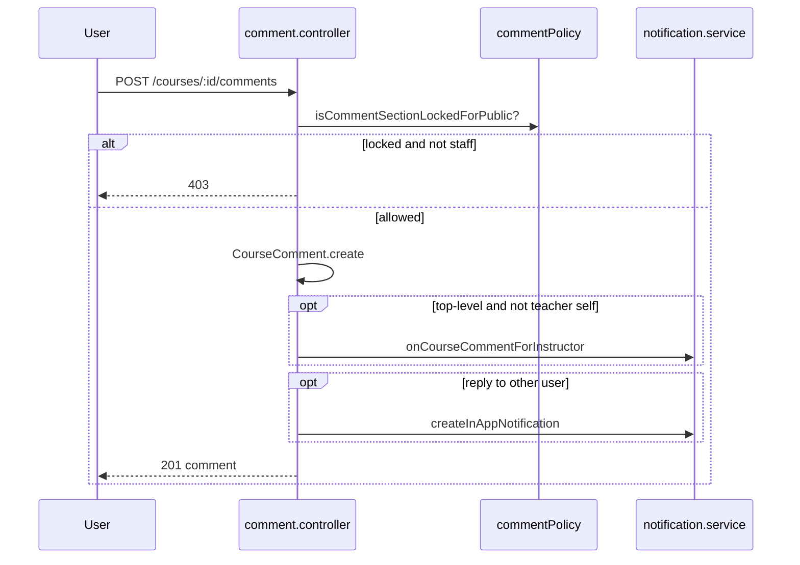

# Production Recommendations — Community (Ratings & Comments)

> **Related:** [Index](./production-recommendations-index.md) · [Course lifecycle](./production-recommendations-course-lifecycle.md) · [Notifications](./production-recommendations-notifications.md)

**Scope:** Course star ratings, Q&A comments, site/course-level disable flags, public display, and moderation.  
**Date:** 2026-05-30  
**Verdict:** **Well-designed split**: ratings require **active enrollment**; comments are **public Q&A on published courses** with **lock policy** for staff-only mode. Minor **enrollment filter inconsistency** and **missing rate limits**.

---

## Executive summary

| Area | Status | Summary |
|------|--------|---------|
| Rating enrollment gate | ✅ Keep | Active enrollment required |
| Self-rating blocked | ✅ Keep | Teacher cannot rate own course |
| Global + per-course disable | ✅ Keep | SiteSettings + `course.ratingsDisabled` |
| Comment lock policy | ✅ Keep | `commentPolicy.js` bypass for staff |
| Soft delete comments | ✅ Keep | Author, teacher, admin can delete |
| Reply notifications | ✅ Keep | In-app to parent author |
| Rating enrollment filter | ⚠️ Update | Strict `status: active` only (no legacy) |
| Comment spam / rate limit | ❌ Add | No throttle on post |
| Public list on unpublished | ✅ | 404 for non-admin |

---

## Policy comparison

| Feature | Ratings | Comments (Q&A) |
|---------|---------|----------------|
| Requires enrollment | Yes (active) | No |
| Requires published course | Implicit (rate on enrolled course) | Yes (except admin) |
| Teacher self-action | Cannot rate own | Can post (bypass lock) |
| Admin override | Disable flags | Bypass lock, view unpublished |
| Delete | N/A (upsert only) | Author, teacher, admin |
| Email notify | No | Reply in-app only |

---

## What to KEEP

1. **`upsertRating`** — 1–5 validation; policy check; enrollment; anti self-rate.
2. **`getRatingSummary`** — public aggregate; exposes policy flags to UI.
3. **`getMyRating`** — returns `null` if not enrolled (not 403).
4. **`listCourseComments`** — cursor pagination; `commentPolicy` in response.
5. **`createCourseComment`** — parent validation; lock check; instructor notify on top-level; reply notify.
6. **`deleteCourseComment`** — soft delete with RBAC.
7. **`commentPolicy.js`** — centralized lock/bypass logic.

---

## HIGH priority

### H1. Rating enrollment — legacy status not included

**File:** `rating.controller.js`

```js
Enrollment.findOne({ ..., status: "active" })
```

Elsewhere app uses `$or: [{ status: "active" }, { status: { $exists: false } }]`.

**Risk:** Legacy enrollments cannot rate.

**Fix:** Use shared `activeEnrollmentMatch` helper (same as notifications/content-access).

---

### H2. No rate limiting on comments or ratings

Abuse: spam Q&A, rating manipulation scripts.

**Fix:** Per-user rate limit on `POST` comment and rating (e.g. 10/min).

---

### H3. Comment content length

Only checks non-empty; no max length.

**Fix:** Cap at 2000–4000 chars (match announcement message cap).

---

## MEDIUM

| Issue | Notes |
|-------|--------|
| No edit comment | Delete + repost only — OK for MVP |
| Rating upsert only | No delete rating — document |
| `getRatingSummary` on deleted course | 404 if course missing — OK |
| User `picture` in comment populate | SSRF/display if malicious URL |
| Moderation queue | No report/flag flow — future |
| Aggregate recompute on every upsert | Fine at scale until high traffic |

---

## Flow: post Q&A comment



---

## Production checklist

- [ ] Align enrollment filter with rest of app for ratings
- [ ] Rate limits on comment create and rating upsert
- [ ] Max comment length validation
- [ ] Test `ratingsGloballyDisabled` and per-course disable in UI
- [ ] Test comment lock: students blocked, teacher/admin can post
- [ ] Verify deleted comments hidden from list (`isDeleted`)

---

## Summary: keep vs update

| Keep | Update |
|------|--------|
| Enrollment-gated ratings | Legacy enrollment match for ratings |
| Comment lock + bypass | Rate limits |
| Soft delete moderation | Comment max length |
| Policy in API responses | Optional report/flag (future) |
| Instructor/reply notifications | — |

---

*Full index: [production-recommendations-index.md](./production-recommendations-index.md)*
