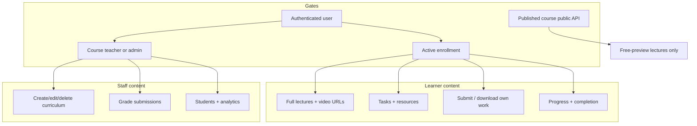

# Production Recommendations — Content Access & Learning Delivery

> **Related:** [Index](./production-recommendations-index.md) · [Auth](./production-recommendations.md) · [Payments](./production-recommendations-payment.md) · [Uploads](./production-recommendations-uploads-media.md) · [Certificates](./production-recommendations-certificates.md) · [Course lifecycle](./production-recommendations-course-lifecycle.md)

**Scope:** How learners, teachers, and admins access course content after (or without) enrollment — lectures, tasks, submissions, progress, workspace APIs, and related frontend flows.  
**Date:** 2026-05-30  
**Verdict:** The **access model is correct in principle** (enrollment as gate, staff ownership checks, free-preview stripping on public API). **Authorization is duplicated and inconsistently enforced**; at least one endpoint is actively broken (`getCourseProgress`).

---

## Executive summary

| Area | Status | Summary |
|------|--------|---------|
| Enrollment as access gate | ✅ Keep | Most learner actions check `Enrollment` |
| Staff course ownership | ✅ Keep | `requireCourseTeacherOrAdmin` pattern (duplicated) |
| Public catalog vs workspace split | ✅ Keep | `getPublicCourse` strips non-preview video URLs |
| Progress & completion | ⚠️ Update | `getCourseProgress` IDOR; progress can be self-reported without proof |
| Submissions | ⚠️ Update | `getMySubmission` skips enrollment; weak role checks on upload |
| Enrollment status consistency | ⚠️ Update | `active` vs legacy vs `refunded` used differently per endpoint |
| Frontend workspace | ⚠️ Update | No enrollment gate in UI; student calls teacher-only bulk progress API |
| Q&A / comments | ~ | Public read; post without enrollment (may be intentional) |
| Analytics endpoints | ✅ Keep | Correctly scoped to course owner/admin |

**Blockers before production launch:** fix `getCourseProgress`, centralize access helpers, enforce student role on learner mutations, align enrollment filters (including post-refund).

---

## Access model (how this app thinks)



**Invariant (from `project-context.md`):** Enrollment is the source of truth for paid learning access. Refunds set `enrollment.status = refunded`, which should block learner content.

---

## What to KEEP (do not rewrite)

### 1. Public course API strips paid video URLs

`getPublicCourse` removes `videoUrl` and `vimeoVideoId` unless `isFreePreview` is true.

**File:** `backend/src/controllers/rating.controller.js` (~lines 197–204)

### 2. Full lectures require enrollment (or staff)

`getLecturesByCourse` allows admin, course owner teacher, or enrolled student only; returns full lecture documents including video fields.

**File:** `backend/src/controllers/lecture.controller.js`

### 3. Tasks list uses same triple gate

`gettasks` mirrors lecture access: admin, owner teacher, or enrolled.

**File:** `backend/src/controllers/task.controller.js`

### 4. Submission upload pipeline

`validateStudentTaskAccess` checks enrollment + task belongs to course; enforces due date for upload/delete.

**File:** `backend/src/controllers/uploadfile.controller.js`

### 5. Grading scoped to course owner

`gradesubmission` verifies teacher owns course (or admin) and student is enrolled.

**File:** `backend/src/controllers/task.controller.js`

### 6. Teacher analytics endpoints

Roster snapshots, curriculum/task analytics, instructor activity — all use `requireCourseTeacherOrAdmin`.

**File:** `backend/src/controllers/course.controller.js`

### 7. Student vs staff course fetch split

- Students: `GET /courses/:courseId/public` (published catalog view)
- Teachers/admins: `GET /courses/:courseId` (workspace; students get 403)

**Files:** `rating.controller.js`, `course.controller.js`

### 8. Unified progress calculation

`updateUnifiedProgress` recalculates `%` when curriculum or completions change (lecture/task delete, submit, mark complete).

**File:** `backend/src/lib/utils.js`

### 9. Ratings require enrollment

`upsertRating` blocks non-enrolled users and course owner self-rating.

**File:** `backend/src/controllers/rating.controller.js`

---

## CRITICAL — fix before production

### C1. `getCourseProgress` — authorization disabled (IDOR)

**Severity:** Critical  
**File:** `backend/src/controllers/course.controller.js` (~lines 797–869)

Access checks are **commented out**. Any authenticated user can:

- Read **any student's** `CourseCompletion` for any course via `?studentId=`
- Read progress **without** being enrolled, the course teacher, or admin

Used by:

- `CourseDashboardPage.jsx` (student workspace)
- `StudentDetailsPage.jsx` (teacher viewing a student — legitimate when fixed)
- `UserDetailsPage.jsx` (admin)

**Fix:** Uncomment and enforce both checks:

1. Requester must be admin, owner teacher, or enrolled in the course.
2. If `studentId` ≠ requester, only admin or owner teacher.

Remove debug `console.log` calls.

---

### C2. Centralize access helpers (prevent future C1-style gaps)

**Severity:** High (root cause of maintenance failures)

The same logic is copy-pasted in **5+ controllers**:

| Helper | Locations |
|--------|-----------|
| `requireCourseTeacherOrAdmin` | `course`, `lecture`, `task`, `certificate`, `vimeoLecture` |
| `activeOrLegacyEnrollmentFilter` | `lecture`, `task`, `uploadfile` (as `activeEnrollmentFilter`) |
| `requireStudentEnrolled` | Defined in `task.controller.js` but **not reused** everywhere |

**Fix:** Single module e.g. `backend/src/lib/courseAccess.js`:

```js
export const activeEnrollmentFilter = { ... };
export async function requireCourseTeacherOrAdmin(req, courseId, res) { ... }
export async function requireStudentEnrolled(req, courseId, res) { ... }
export async function canAccessCourseContent(req, courseId) { ... } // admin | owner | enrolled
```

Use in every content endpoint; add a short test or checklist per new route.

---

## HIGH priority — update soon

### H1. `getMySubmission` — no enrollment check

**Severity:** High (information disclosure)  
**File:** `backend/src/controllers/uploadfile.controller.js` (~lines 121–143)

Any authenticated user with a `taskId` receives task metadata (`title`, `dueDate`, `type`) and their submission if it exists — **without** verifying enrollment in the course.

**Fix:** Resolve course from task → run `requireStudentEnrolled` (or shared helper).

---

### H2. Learner mutations missing explicit `role === 'student'`

**Severity:** Medium–High  
**Files:** `uploadfile.controller.js`, `task.controller.js` (`markTaskAsComplete`), `lecture.controller.js` (`markLectureAsComplete`, `toggleLectureAcknowledgment`)

Examples:

- `uploadfile`: `if (!req.user)` → 403 `"Only students"` (wrong status/message; no role check)
- `markTaskAsComplete`: message says "Only students" but only checks `!req.user`, not role
- `markLectureAsComplete`: any **enrolled** user can mark complete — including a teacher/admin if they have an enrollment row

**Fix:** Add `req.user.role !== 'student'` → 403 on all learner-only mutations.

---

### H3. Inconsistent enrollment status filters

**Severity:** Medium–High  

| Filter | Used where |
|--------|------------|
| `{ status: 'active' }` only | `getCourseProgress` (computed), `recordCourseWorkspaceVisit`, rating enrollment check |
| `activeOrLegacyEnrollmentFilter` (`active` OR missing status) | Lectures, tasks, uploads, most learner flows |
| Refunded | Not in learner filters → **refunded users blocked** from content (good) |

Legacy enrollments without `status` field work in lectures/tasks but may fail workspace visit tracking or rating.

**Fix:** One exported `activeEnrollmentFilter` used everywhere; document that `refunded` / `cancelled` never grant content access.

---

### H4. Progress can be inflated without consuming content

**Severity:** Medium (integrity / certificates)  

Students can call:

- `POST /courses/lecture/:courseId/:lectureId` — mark lecture complete
- `POST /courses/task/:courseId/:taskId` — mark task complete (without file upload)

Both only require enrollment, not video watch or submission.

**Impact:** Progress → 100% → certificate eligibility (after teacher approval).

**Fix options (product decision):**

1. **Strict:** Only mark lecture complete via player events / minimum watch time (hard).
2. **Moderate:** Mark complete only after acknowledgment + for non-video types; assignments require submission before `completedTasks`.
3. **Document:** Accept self-reported progress; teacher approves certificates manually (current partial mitigation).

---

### H5. Frontend workspace calls teacher APIs for all users

**Severity:** Medium (UX + noise, not security if API holds)  
**File:** `frontend/src/pages/course/CourseDashboardPage.jsx`, `frontend/src/api/course.js`

- `useGetBulkProgress(courseId)` runs whenever `courseId` is set — **including for students** → predictable 403.
- `useGetStudentsByCourse(courseId)` same pattern for students.
- No client-side **enrollment check** before rendering student workspace; relies on API failures.

**Fix:**

- Pass `enabled: is_instructor` to bulk progress and students hooks.
- Optional: `useEnrollmentSnapshot` + redirect to checkout/catalog if not enrolled and not staff.

---

### H6. `updatetask` — weak task/course binding

**Severity:** Medium  
**File:** `backend/src/controllers/task.controller.js` (~lines 202–217)

Verifies teacher owns `courseId` but does not assert `taskId` is in `course.tasks`. Wrong `courseId` in URL could update a task attached to another course if IDs are guessed.

**Fix:** `if (!course.tasks.some(id => id.equals(taskId))) return 404`.

Same audit for `updatetask` / lecture update paths.

---

### H7. Q&A comments do not require enrollment

**Severity:** Medium (product/security policy)  
**File:** `backend/src/controllers/comment.controller.js`

Any authenticated user can post on a **published** course when comments are not locked. No enrollment check.

**If Q&A is public marketing:** document and keep.  
**If Q&A is for buyers only:** add enrollment check (or enrolled + staff bypass).

Reading comments is public (`GET` without `protectRoute`) — usually fine for social proof.

---

### H8. `getStudentSubmissionsByCourse` — admin sees all courses

**Severity:** Low–Medium (intentional ops power)  
**File:** `backend/src/controllers/course.controller.js`

Teachers are ownership-scoped; **admins skip** `requireCourseTeacherOrAdmin` and can read any student's submissions for any course.

**Fix:** Document as admin capability; add audit logging if compliance matters.

---

## MEDIUM priority — improve quality

### M1. `useGetCourseProgress` always enabled

**File:** `frontend/src/api/course.js`

`enabled: !!courseId` — fires even when user shouldn't have access. Prefer `enabled: !!courseId && (isStudent || isInstructor)`.

---

### M2. Student workspace data sources

Students load `useGetPublicCourse` when no navigation state — correct for metadata. Full lectures come from `useGetLecturesByCourse` after enrollment. Document this two-step pattern so future devs don't expose URLs via public API.

---

### M3. Submission downloads are client-side blob fetches

**File:** `frontend/src/lib/submissionDownload.js`

Teachers download student files via Cloudinary URL in browser. Authorization is whatever the API returned in submissions list; URLs are **unguessable but not time-limited**.

**Fix (optional):** Signed Cloudinary URLs or proxy download endpoint with auth re-check.

---

### M4. Multer on submissions — no file type filter in route

**File:** `backend/src/routes/upload.route.js`

Manual payments restrict MIME types; general `upload` uses multer with dest only — relies on Cloudinary / client.

**Fix:** Align with manual payment `fileFilter` (pdf, doc, images, size cap).

---

### M5. `deletecourse` hard-deletes curriculum

Breaks historical progress/submission context. Prefer soft-delete for production (see payment doc). Content access doc: orphaned `CourseCompletion` / `Submission` rows may reference deleted tasks/lectures — `updateUnifiedProgress` filters stale IDs (good).

---

### M6. Debug logging in hot paths

`getCourseProgress` logs on every hit. Remove for production.

---

## LOW priority — nice to have

| Item | Notes |
|------|--------|
| Enrollment-gated comment read | Usually unnecessary |
| IP/device binding for content | Rare for LMS |
| HLS signed URLs for Vimeo | Vimeo privacy settings + embed domain lock |
| Audit log for grade changes | Helpful for disputes |
| Rate limit mark-complete endpoints | Prevent progress spam |

---

## Endpoint access matrix (reference)

| Endpoint | Auth | Learner | Teacher (owner) | Admin |
|----------|------|---------|-----------------|-------|
| `GET /courses/:id/public` | No | Preview URLs only | Same | Same |
| `GET /course/:id/lectures` | Yes | Enrolled | Owner | All |
| `GET /courses/:id/gettasks` | Yes | Enrolled | Owner | All |
| `POST /upload` | Yes | Enrolled student | ❌ | ❌* |
| `GET /submissions/me/:taskId` | Yes | ⚠️ No enroll check | N/A | N/A |
| `GET /submissions/:taskId` | Yes | Own only | Owner | All |
| `POST .../gradesubmission` | Yes | ❌ | Owner | All |
| `GET /progress/:courseId` | Yes | ⚠️ **Broken** | Should be owner | All |
| `GET /progress/bulk/:id` | Yes | ❌ | Owner | All |
| `POST .../markLecture complete` | Yes | Enrolled** | Enrolled** | Enrolled** |
| `GET /courses/:id` (workspace) | Yes | ❌ 403 | Owner | All |
| `POST /courses/:id/comments` | Yes | Any user† | Staff bypass lock | Staff |
| `POST /courses/:id/ratings` | Yes | Enrolled | ❌ own course | — |

\* Unless enrolled as student  
\** Should be student-only after H2 fix  
† When comments open; no enrollment required today

---

## Frontend checklist

| Item | Status | Action |
|------|--------|--------|
| Student checkout before workspace | Partial | API enforces; UI could redirect |
| `useGetBulkProgress` gated | ❌ | `enabled: is_instructor` |
| `useGetStudentsByCourse` gated | ❌ | Same |
| Teacher tab routes | ✅ | Redirects for invalid tabs |
| Student cannot open teacher tabs | ✅ | Navigate away from `workspaceTab` |
| Progress displayed from API | ⚠️ | API must be fixed first |
| Submission upload page | ✅ | Uses authenticated upload API |
| Task submissions page (teacher) | ✅ | API enforces ownership |

---

## Production checklist (content access)

- [ ] **C1** `getCourseProgress` checks restored and tested
- [ ] **C2** Shared `courseAccess.js` module; controllers migrated
- [ ] **H1** `getMySubmission` enrollment check
- [ ] **H2** Student role on learner mutations
- [ ] **H3** Single enrollment filter constant
- [ ] **H4** Product decision on self-reported progress documented
- [ ] **H5** Frontend hooks use correct `enabled` flags
- [ ] **H7** Q&A enrollment policy decided and implemented
- [ ] Refunded enrollment tested: no lectures/tasks/submissions
- [ ] Free preview: only preview lectures expose URLs on public page
- [ ] Teacher cannot access another teacher's course workspace via API (403)
- [ ] Manual test matrix: student / teacher / admin × enrolled / not enrolled

---

## Recommended implementation order

1. **C1** — Fix `getCourseProgress` (same day)
2. **C2** — Extract `courseAccess.js`
3. **H1, H2, H3** — Submission fetch + role checks + enrollment filter
4. **H5** — Frontend hook `enabled` guards
5. **H6** — Task/lecture ID binding in updates
6. **H4, H7** — Product decisions (progress integrity, Q&A scope)
7. **M4** — Upload file type limits

---

## Summary: keep vs update

| Keep | Update / add |
|------|----------------|
| Enrollment-gated lectures & tasks | Fix `getCourseProgress` IDOR |
| Public API video stripping | Centralize access helpers |
| Submission upload validation | Enrollment check on `getMySubmission` |
| Teacher ownership on grade/roster | Student role on learner endpoints |
| Staff analytics scoping | Consistent enrollment status filter |
| Rating enrollment requirement | Frontend bulk API `enabled` flags |
| Unified progress recalculation | Progress integrity policy |
| Refund → `enrollment.refunded` blocks legacy filter | Q&A enrollment policy |
| | Upload MIME/size limits |

---

*Update this file when content access rules change. Certificates: [`production-recommendations-certificates.md`](./production-recommendations-certificates.md). Next: uploads & media.*
