# Production Recommendations — Course Lifecycle & Catalog

> **Related:** [Index](./production-recommendations-index.md) · [Content access](./production-recommendations-content-access.md) · [Payments](./production-recommendations-payment.md)

**Scope:** Course creation, publish/unpublish, soft vs hard delete, public catalog, instructor workspace vs student views, readiness checklist, and pricing display on listings.  
**Date:** 2026-05-30  
**Verdict:** **Clear publish gate for instructors** (`validateCourseReadyForReview`). **Two delete paths** (soft admin vs hard teacher) create **data-loss and orphan enrollment** risks. Catalog filters are **consistent** for public listings.

---

## Executive summary

| Area | Status | Summary |
|------|--------|---------|
| Public catalog filters | ✅ Keep | `isPublished`, `status: published`, `isDeleted` |
| Instructor publish checklist | ✅ Keep | Blocks empty/incomplete courses |
| `getPublicCourse` strips video URLs | ✅ Keep | Preview-only leak prevention |
| Admin soft delete | ✅ Keep | Sets `isDeleted`, unpublishes |
| Teacher hard delete | ❌ Fix | Cascades lectures/tasks; orphans enrollments/payments |
| Admin publish toggle | ⚠️ Update | No readiness checklist |
| Duplicate course title check | ~ | Weak uniqueness (`title + description`) |
| `students` array on course | ⚠️ Legacy | Enrollment is source of truth |

---

## Lifecycle state machine

```mermaid
stateDiagram-v2
    [*] --> Draft: createcourse
    Draft --> Published: publishCourseAsInstructor (checklist OK)
    Published --> Archived: setCoursePublished(false) admin
    Archived --> Published: setCoursePublished(true) admin
    Draft --> Published: admin setCoursePublished(true) no checklist
    Published --> SoftDeleted: softDeleteCourse admin
    Any --> HardDeleted: deletecourse teacher/admin
    note right of HardDeleted: Deletes lectures/tasks;\nEnrollment refs may dangle
```



---

## What to KEEP

1. **`getcourses`** — public catalog with rating summaries + `attachPricingToCourseDoc`.
2. **`publishCourseAsInstructor`** — owner or admin; runs `validateCourseReadyForReview`.
3. **`getPublicCourse`** (in `rating.controller.js`) — strict published filter; strips non-preview video fields.
4. **`getCourseById`** — teacher/admin workspace; students blocked (403).
5. **`softDeleteCourse`** — admin-only; unpublishes.
6. **`updateCourseDetails`** — owner/admin; blocks edits on deleted courses.
7. **Pricing on listings** — server-side effective price via `coursePricing.js`.

---

## CRITICAL / HIGH

### C1. Hard delete (`deletecourse`) vs soft delete

**File:** `course.controller.js` — `deletecourse`

- **Hard deletes** course document
- **`Lecture.deleteMany`**, **`Task.deleteMany`**
- Does **not** remove enrollments, payments, completions, comments, ratings

**Risk:** Orphan records; students see broken enrollments; finance/reporting inconsistency.

**Fix:** Prefer **soft delete only** for production; or cascade/archive related collections; block hard delete if enrollments exist.

---

### H1. Admin can publish without checklist

**File:** `setCoursePublished` — admin sets `isPublished` directly.

Instructor path requires `validateCourseReadyForReview`; admin bypass may publish empty courses.

**Fix:** Run same checklist for admin publish, or document intentional override.

---

### H2. Teacher can hard-delete published course with active students

No enrollment count check before `deletecourse`.

**Fix:** Require zero active enrollments or admin-only hard delete.

---

### H3. `createcourse` duplicate detection

```js
Course.findOne({ title, description })
```

Different description → duplicate titles allowed; same pair blocked. Weak for catalog UX.

**Fix:** Unique slug or title per teacher; or global unique title.

---

### H4. Course `students` array vs `Enrollment`

Public meta uses `course.students?.length` in `getPublicCourse` — may not match enrollment count.

**Fix:** Count from `Enrollment` for `totalStudents` display.

---

### H5. Unpublished course comment list

**File:** `comment.controller.js` — unpublished courses return 404 for non-admin on list.

Good for hiding; ensure public page doesn't leak draft course IDs elsewhere.

---

## MEDIUM

| Issue | Notes |
|-------|--------|
| `status` vs `isPublished` dual fields | Must stay in sync — publish flows set both |
| Archived courses in teacher hub | Teacher should still see own archived |
| Category from site settings | Admin categories list; validate on create |
| Trailer vs lecture preview | Two preview mechanisms — document |
| Course image upload on create | No size limit (uploads doc) |

---

## API visibility matrix

| Endpoint | Who | Published only? |
|----------|-----|-----------------|
| `GET /courses` | Public | Yes |
| `GET /courses/public/:id` | Public | Yes |
| `GET /courses/:id` | Teacher owner / admin | No |
| `GET /courses/enrolled` | Student | Enrolled (any publish state) |
| `PATCH publish` | Owner / admin | N/A |
| `DELETE /courses/:id` | Owner / admin | Hard delete |

---

## Production checklist

- [ ] Disable or gate hard delete in production
- [ ] Align admin publish with readiness checklist
- [ ] Student count from Enrollment on public pages
- [ ] Soft-deleted courses hidden from catalog (verified)
- [ ] Document instructor publish checklist requirements for teachers
- [ ] Verify refund/enrollment behavior when course soft-deleted

---

## Summary: keep vs update

| Keep | Update |
|------|--------|
| Public catalog filters | Remove or restrict hard delete |
| Instructor publish checklist | Admin publish parity |
| Public course video stripping | Enrollment-based student counts |
| Soft delete for admin | Block delete with active enrollments |
| Workspace RBAC on `getCourseById` | Stronger duplicate title policy |

---

*See also: [Community (ratings & comments)](./production-recommendations-community.md)*
