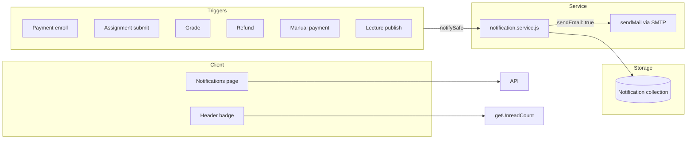

# Production Recommendations — Notifications & Email

> **Related:** [Index](./production-recommendations-index.md) · [Auth](./production-recommendations.md) · [Payments](./production-recommendations-payment.md)

**Scope:** In-app notifications, transactional email, announcements, user preferences, and event triggers from commerce/learning flows.  
**Date:** 2026-05-30  
**Verdict:** **Solid decoupled design** (`notification.service.js` + `notifySafe`). Announcements are **in-app only** (no email blast). Email is **optional SMTP** with sensible preference gates.

---

## Executive summary

| Area | Status | Summary |
|------|--------|---------|
| `notifySafe` fire-and-forget | ✅ Keep | Failures don't break main flows |
| Event triggers (enroll, grade, refund, manual pay) | ✅ Keep | Centralized in service |
| User email preferences | ✅ Keep | `notificationEmailEnabled`, `notificationLevel` |
| Announcement targeting rules | ✅ Keep | Admin broad / teacher course-only |
| Announcements — no email | ~ | By design; document for ops |
| Bulk insert chunking | ✅ Keep | 500 per batch |
| Notification ownership on read/delete | ✅ Keep | Scoped to `req.user._id` |
| Email on all events | ⚠️ Review | Only some events set `sendEmail: true` |
| No push / websocket | ~ | Polling/refetch only |

---

## Architecture

---

## What to KEEP

1. **`createInAppNotification`** — single write path with optional email.
2. **`maybeSendEmailForNotification`** — respects `notificationEmailEnabled` and `notificationLevel === 'important'` filter for `type: info`.
3. **`isMailConfigured()`** — signup skips verification when SMTP off; documented in auth.
4. **`sendAnnouncements`** — role matrix:
   - Teacher → `course` only, own courses
   - Admin → all_users, students, instructors, course
5. **Pagination** on `GET /notifications` (max 50/page).
6. **Mark read / delete** — user-scoped by `_id` + `user`.
7. **Transactional emails** for enrollment (student + teacher + admins) with `sendEmail: true`.

---

## HIGH priority

### H1. Announcements do not send email

**File:** `notification.controller.js` — `sendAnnouncements`

Bulk in-app only. Important campus-wide alerts won't reach email inboxes.

**Fix (product):** Optional `sendEmail: true` for `isImportant` announcements with rate limits and unsubscribe respect.

---

### H2. Email verification / password reset depend on SMTP

**Cross-ref:** auth doc

If SMTP misconfigured in production, users can't verify email or reset password.

**Fix:** Production checklist must require SMTP; monitor send failures.

---

### H3. No idempotency on event notifications

Double webhook / double submit could duplicate "Enrollment confirmed" notifications.

**Fix:** Dedupe key on `(userId, actionType, courseId)` within time window, or accept duplicates for MVP.

---

### H4. Admin enrollment notifies all admins on every sale

**File:** `onCourseEnrolledFromPayment`

Could spam large admin teams.

**Fix:** Configurable or digest email.

---

## MEDIUM

| Issue | Notes |
|-------|--------|
| No notification cleanup/TTL | Collection grows forever — archive job |
| `deleteOne` hard-deletes notification | OK; no soft delete |
| Frontend polling vs websocket | Refetch on focus; acceptable |
| Email templates plain text only | Branding opportunity |
| `relatedUser` / `task` refs | Good for deep links; verify UI uses them |
| Comment reply notifications | In-app via `createInAppNotification`; email off |

---

## Event → email matrix

| Event | In-app | Email (`sendEmail`) |
|-------|--------|---------------------|
| Course enrolled (student) | ✅ | ✅ |
| New enrollment (teacher) | ✅ | ✅ |
| New enrollment (admins) | ✅ | ❌ |
| Assignment submitted (teacher) | ✅ | ✅ |
| Assignment graded (student) | ✅ | ✅ |
| Refund submitted/completed | ✅ | varies |
| Manual payment proof (admins) | ✅ | ❌ |
| Lecture/task published | ✅ | ❌ |
| Announcement | ✅ | ❌ |

---

## Production checklist

- [ ] SMTP env vars set and tested (verify + reset + one notification)
- [ ] `notificationEmailEnabled` default documented for users
- [ ] Announcement policy documented (in-app vs email)
- [ ] Monitor `Send notification email failed` logs
- [ ] Rate limit `POST /notifications/send` (admin/teacher broadcast abuse)
- [ ] Consider notification retention policy (90 days?)

---

## Summary: keep vs update

| Keep | Update |
|------|--------|
| `notification.service` pattern | Optional email for important announcements |
| `notifySafe` | SMTP required in prod checklist |
| User preference fields | Dedupe noisy commerce notifications |
| Announcement RBAC | Notification TTL/archive |
| User-scoped read/delete | Rate limit broadcast endpoint |

---

*See also: [Course lifecycle](./production-recommendations-course-lifecycle.md)*
