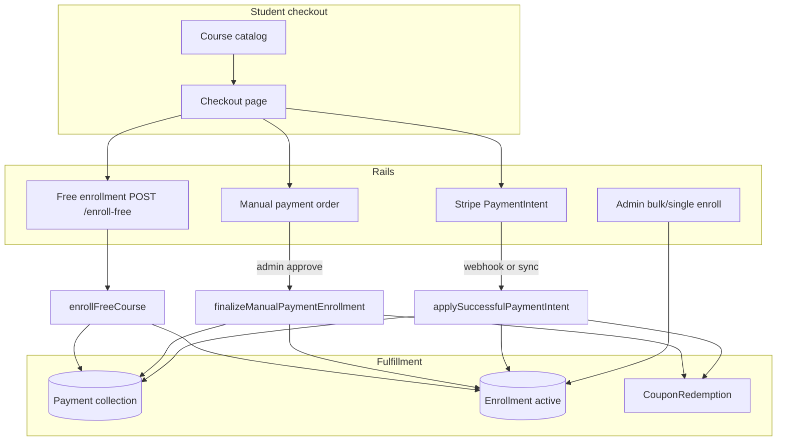
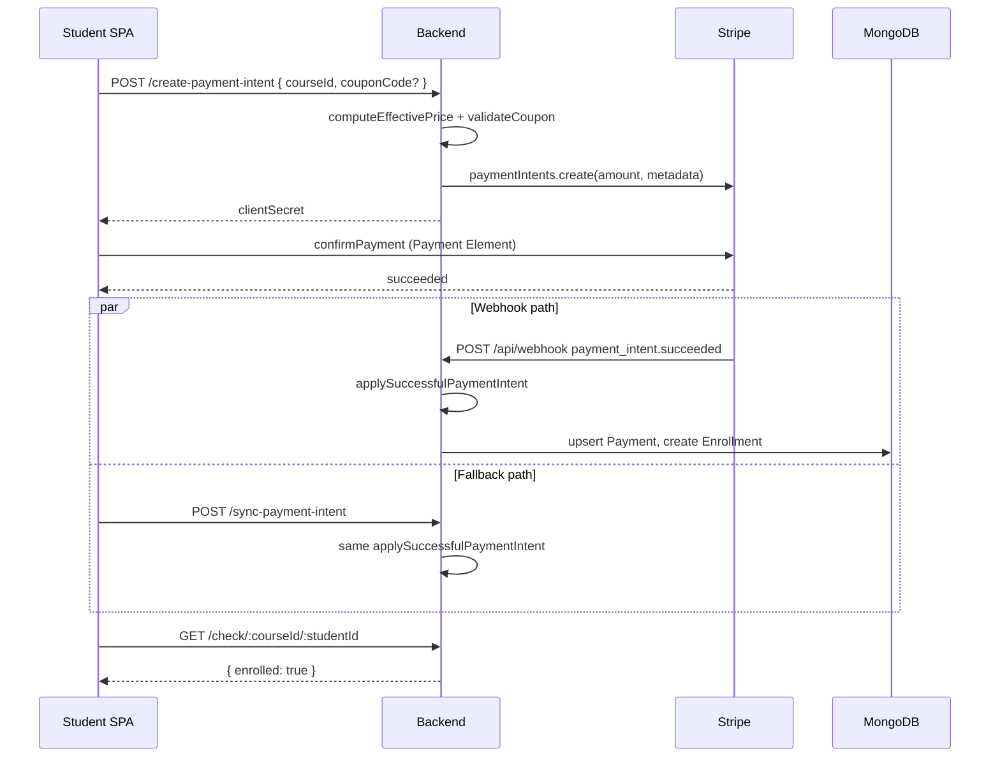
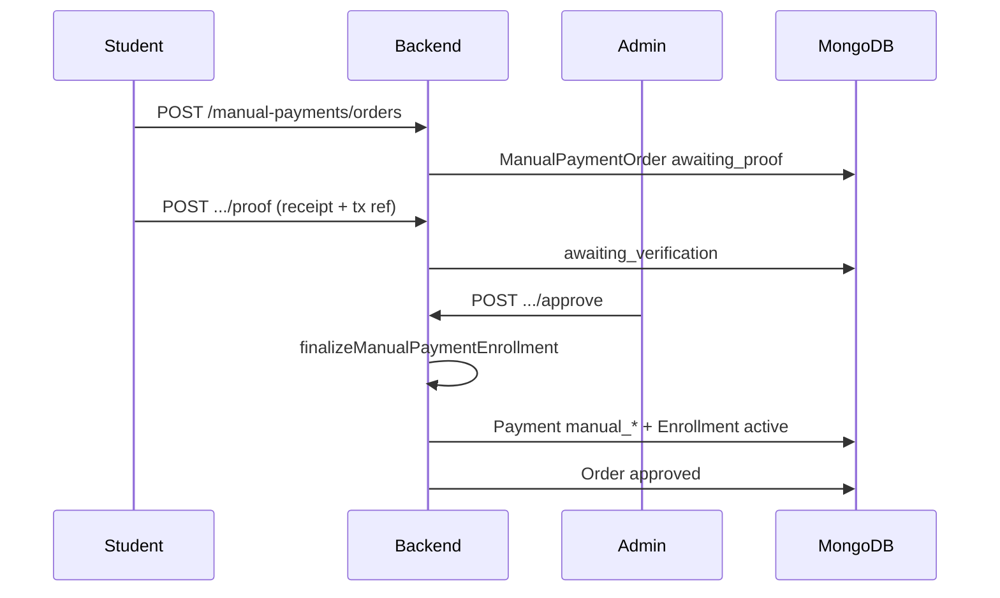
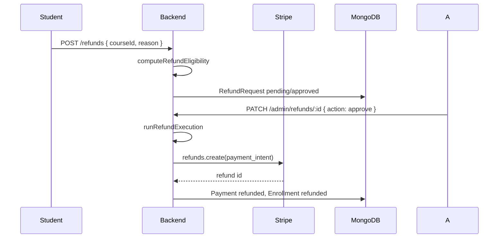

# Production Recommendations — Payments & Finance

> **Related:** [Index](./production-recommendations-index.md) · [Auth](./production-recommendations.md) · [Content access](./production-recommendations-content-access.md) · [Certificates](./production-recommendations-certificates.md) · [Admin](./production-recommendations-admin-ops.md) · [Course lifecycle](./production-recommendations-course-lifecycle.md)

**Scope:** Stripe checkout, webhooks, manual payments, coupons, refunds, enrollments-as-access, admin finance, and related frontend billing flows.  
**Date:** 2026-05-30  
**Verdict:** The **payment architecture is thoughtfully designed** (server-side pricing, idempotent fulfillment, dual rails). Several **refund and data-integrity gaps** must be fixed before production, especially for manual payments and concurrent enrollment.

---

## Executive summary

| Area | Status | Summary |
|------|--------|---------|
| Server-side price computation | ✅ Keep | `coursePricing.js` + coupon validation at checkout |
| Stripe fulfillment idempotency | ✅ Keep | Upsert on `stripePaymentIntentId`; shared `applySuccessfulPaymentIntent` |
| Manual payment workflow | ✅ Keep | Order lifecycle, tx-ref dedup, audit log, admin approve/reject |
| Refund policy engine | ✅ Keep | Window, progress cap, audit log, Stripe idempotency key |
| Refunds for non-Stripe payments | ❌ Broken | Gateway refund always calls Stripe with synthetic PI ids |
| Enrollment uniqueness | ⚠️ Update | No compound unique index; race can duplicate enrollments |
| Finance reporting | ⚠️ Update | Mixes Stripe/manual/free; admin comp enrollments invisible |
| Webhook coverage | ⚠️ Update | Only `payment_intent.succeeded`; no external refund/dispute sync |
| Coupon global limits | ⚠️ Update | `maxRedemptions` checked at checkout, not atomically at fulfillment |

**Blockers before production launch:** manual/free refund path, enrollment unique constraint, re-validate price at fulfillment (Stripe), student-only refund requests, document admin comp enrollment policy.

---

## Payment rails overview



| Rail | Entry | Payment record | Enrollment | Refund via Stripe |
|------|--------|----------------|------------|-------------------|
| Stripe card | `POST /create-payment-intent` | `provider: stripe` | Webhook / sync | ✅ Intended |
| Manual bank/wallet | `POST /manual-payments/orders` | `provider: manual`, id `manual_<orderId>` | Admin approve | ❌ Not implemented |
| Free course | `POST /enroll-free` | `provider: free`, id `free_<course>_<student>` | Immediate | N/A (no money) |
| Admin comp | `POST /enroll/:courseId/:studentId` or bulk | **None** | Immediate | N/A |

---

## What to KEEP (do not rewrite)

### 1. Server-side pricing authority

Checkout never trusts client amounts. Card and manual flows call `computeEffectivePrice()` and optional `validateCouponForCheckout()` before setting charge amount.

**Files:** `backend/src/lib/coursePricing.js`, `backend/src/lib/couponCheckout.js`, `payment.controller.js`, `manualPayment.controller.js`

### 2. Shared Stripe fulfillment helper

`applySuccessfulPaymentIntent()` is used by both webhook and `POST /sync-payment-intent`, with upsert on `stripePaymentIntentId`.

**Files:** `backend/src/controllers/payment.controller.js`, `backend/src/controllers/webhook.controller.js`

### 3. Idempotent manual fulfillment

`finalizeManualPaymentEnrollment()` handles duplicate key on `manual_<orderId>` and heals missing enrollment if payment already exists.

**File:** `backend/src/controllers/payment.controller.js`

### 4. Manual payment operational design

- Order states: `awaiting_proof` → `awaiting_verification` → `approved` / `rejected`
- Normalized transaction reference + clash detection per payment method
- Submission history on resubmit after rejection
- Per-order `auditLog` and admin actor on approve/reject

**Files:** `manualPayment.controller.js`, `manualPaymentOrder.model.js`

### 5. Refund eligibility as a service

`computeRefundEligibility()` centralizes policy: enabled flag, payment window, progress cap, enrollment state, duplicate request.

Re-validated at execution via `validateEligibilityForExecution()`.

**File:** `backend/src/services/refund.service.js`

### 6. Stripe refund idempotency

`executeGatewayRefund()` uses idempotency key `refund_req_<requestId>` — safe retries.

**File:** `backend/src/services/refund.service.js`

### 7. Access gate: enrollment

Paid learning access flows through `Enrollment` with `status: active`. Refunds set enrollment to `refunded`.

**File:** `backend/src/models/enrollment.model.js`

### 8. Frontend checkout safeguards

- Checkout requires login; **student role only** for purchase
- Coupon validated server-side before apply (`useValidateCheckoutCoupon`)
- Success page calls `syncPaymentIntent` + polls enrollment
- Manual and card modes; Stripe key optional (falls back to manual)

**Files:** `frontend/src/pages/billing/PaymentPage.jsx`, `SuccessPage.jsx`, `frontend/src/api/payment.js`

### 9. Rate limits on payment writes

`paymentWriteLimiter` on PI create, sync, enroll-free, manual order/proof, admin approve/reject.

**File:** `backend/src/routes/payment.route.js`, `manualPayment.route.js`

### 10. Webhook raw body + signature verification

Webhook mounted before `express.json()` with `express.raw()`; `constructEvent` validates signature.

**File:** `backend/index.js`, `webhook.controller.js`

---

## CRITICAL — fix before production

### C1. Refunds only work for Stripe card payments

**Severity:** Critical (manual payment users cannot be refunded through the app)  
**File:** `backend/src/services/refund.service.js` — `executeGatewayRefund`, `runRefundExecution`

All refunds call:

```js
stripe.refunds.create({ payment_intent: payment.stripePaymentIntentId, ... })
```

Manual payments use synthetic ids (`manual_<orderId>`). Free enrollments use `free_<courseId>_<studentId>`. **Stripe API will reject these.**

`computeRefundEligibility()` does not filter by `payment.provider`.

**Fix:**

1. At eligibility: if `payment.provider !== 'stripe'`, return reason code `manual_refund_required` or `non_stripe_payment`.
2. Implement **manual refund workflow**: admin marks refund completed off-platform, updates `Payment.status`, enrollment, and `RefundRequest` without Stripe call.
3. For `provider: free`, block refunds or handle as enrollment revocation only (no money movement).
4. UI: show different admin actions for Stripe vs manual vs free on `AdminRefundsPage`.

---

### C2. No unique constraint on `(student, course)` enrollments

**Severity:** Critical (duplicate access rows under concurrency)  
**File:** `backend/src/models/enrollment.model.js`

`applySuccessfulPaymentIntent`, `syncPaymentIntent`, webhook retries, and `enrollFreeCourse` all check-then-insert enrollment. Two concurrent successes can both pass the check and create **two active enrollments** (no unique index).

**Fix:**

```js
enrollmentSchema.index({ student: 1, course: 1 }, { unique: true });
```

Use `findOneAndUpdate` with `upsert: true` or catch `11000` and treat as success in all fulfillment paths.

---

### C3. Coupon `maxRedemptions` race (overselling)

**Severity:** High → Critical at scale  
**Files:** `couponCheckout.js`, `couponRedemption.service.js`

Validation reads `coupon.redeemedCount` at checkout. Increment happens **after** payment success. Parallel checkouts can exceed `maxRedemptions`.

**Fix:** Atomic reservation at PI/order creation:

- `$inc` with condition `redeemedCount < maxRedemptions`, or
- separate `reservedCount` with TTL, confirmed on fulfillment, released on failure.

---

### C4. `createRefundRequest` has no student role check

**Severity:** High  
**File:** `backend/src/controllers/refund.controller.js`

Any authenticated user (teacher/admin) could open a refund request against their own purchase if they bought as a student — edge case. Teachers/admins buying courses is blocked at checkout, but API should enforce `req.user.role === 'student'`.

**Fix:** Add role guard consistent with `paymentIntent` and `enrollFreeCourse`.

---

## HIGH priority — update soon

### H1. No amount verification at Stripe fulfillment

**Severity:** High (business integrity)  
**File:** `applySuccessfulPaymentIntent`

Stores `paymentIntent.amount_received` without recomputing expected price from course + coupon metadata at fulfillment time.

If metadata were tampered in Stripe Dashboard (compromised Stripe account), or a stale PI is paid after a **coupon expired**, the system still enrolls.

**Fix:** On fulfillment, recompute expected cents from DB course + `metadata.couponId`; reject enrollment if `amount_received` mismatch (log alert, return 500 to webhook for retry investigation).

---

### H2. Admin enrollments create no `Payment` record

**Severity:** High (finance / audit)  
**Files:** `enrollatcourse`, `bulkEnrollAtCourse` in `payment.controller.js`

Admin comp and bulk enroll create `Enrollment` only — invisible in finance dashboard, exports, and refund flows.

**Fix options:**

- Create `Payment` with `provider: 'admin_comp'`, `amount: 0`, synthetic id `comp_<course>_<student>`.
- Or explicit `CompEnrollment` audit table linked to admin actor and timestamp.

Document which policy the product uses.

---

### H3. `approveManualPaymentOrder` — enrollment before order status is atomic

**Severity:** High (state inconsistency)  
**File:** `manualPayment.controller.js`

Flow: `finalizeManualPaymentEnrollment(pending)` → then `findOneAndUpdate` order to `approved`.

If enrollment succeeds but order update fails, student has access while order still shows `awaiting_verification`.

**Fix:** MongoDB transaction (session) wrapping both, or set order to `approved` only inside a single service that rolls back enrollment on failure (harder). Minimum: reconciliation job + admin alert.

---

### H4. Manual approve does not re-validate order amount vs current course price

**Severity:** Medium–High  
**File:** `approveManualPaymentOrder`

Order amount is fixed at creation. Course price/promotion/coupon may change before admin approval.

**Fix:** On approve, recompute expected amount; warn or block if `order.amount` differs beyond tolerance; require admin override note.

---

### H5. Webhook handles only `payment_intent.succeeded`

**Severity:** Medium–High  
**File:** `webhook.controller.js`

Missing handlers for:

- `charge.refunded` / `refund.updated` (refunds initiated in Stripe Dashboard)
- `charge.dispute.created` (chargebacks)
- `payment_intent.payment_failed` (logging/metrics)

**Fix:** Add handlers to sync `Payment.status` and enrollment when refunds/disputes happen outside the app.

---

### H6. `sync-payment-intent` is a necessary backdoor — lock down for production

**Severity:** Medium–High  
**File:** `payment.controller.js` — `syncPaymentIntent`

Correctly restricts to PI owner or admin. Still allows client-triggered fulfillment if webhook fails (localhost/dev pattern).

**Fix for production:**

- Keep for dev/staging only via env flag, **or**
- Require PI metadata + recent success timestamp + rate limit (already limited).
- Monitor for abuse (same user, many syncs).

---

### H7. Orphan Stripe PaymentIntents on checkout page load

**Severity:** Medium (cost + dashboard noise)  
**Files:** `frontend/src/api/payment.js`, `PaymentPage.jsx`

`useGetPaymentIntent` auto-creates a PI when checkout loads (`staleTime: Infinity`). Users who abandon checkout leave open PIs in Stripe.

**Fix:** Create PI on explicit “Pay now” / tab confirm, not on page mount; or cancel stale PIs server-side when creating new ones for same student+course.

---

### H8. Finance overview mixes providers without breakdown

**Severity:** Medium  
**File:** `admin.controller.js` — `getFinanceOverview`

Aggregates all `status: succeeded` payments — includes **$0 free** and **manual** in revenue totals (manual amounts are real; free inflates transaction count).

**Fix:** Add `provider` dimension to aggregates; separate KPI cards for Stripe vs manual vs free vs comp.

---

### H9. `partially_refunded` payment status unused

**Severity:** Medium  
**Files:** `payment.model.js`, `refund.service.js`

Schema allows `partially_refunded` but `finalizeSuccessfulRefund` always sets `refunded` even for partial percent refunds.

**Fix:** Set status based on `refundPercent`; keep enrollment active or partial-access policy documented if partial refunds should retain access.

---

### H10. Hard delete course destroys learning + payment context

**Severity:** Medium (audit)  
**File:** `course.controller.js` — `deletecourse`

Hard-deletes course, lectures, tasks. `Payment` and `Enrollment` documents may orphan or break admin reports.

**Fix:** Prefer admin soft-delete only (`softDeleteCourse` exists); block hard delete when succeeded payments exist, or retain financial records with course snapshot fields.

---

## MEDIUM priority — improve quality

### M1. Currency hardcoded to USD

**Files:** `payment.controller.js`, `manualPayment.controller.js`, Stripe PI creation

No multi-currency support. Fine if product is USD-only — document invariant.

---

### M2. Public manual payment methods expose account numbers

**File:** `GET /manual-payments/methods` (public)

Returns `accountNumber`, `accountHolder` for active methods — required for bank transfer UX but is sensitive.

**Fix:** Rate limit public endpoint; consider masking except last 4 digits in list view with full detail only after order creation.

---

### M3. Refund eligibility allows `cancelled` enrollment status

**File:** `refund.service.js`

```js
const isActive = !st || st === "active" || st === "cancelled";
```

Unclear product meaning of `cancelled` vs `refunded`. Document and align with admin tools.

---

### M4. `refundPolicyAcceptedAt` not set for admin enrollments

**File:** `enrollatcourse`, `bulkEnrollAtCourse`

Only Stripe/manual/free set policy acceptance timestamp. Admin comps skip — may affect refund policy display.

---

### M5. No Stripe Customer object / saved payment methods

PaymentIntents are one-off. No subscription or saved cards — acceptable for course marketplace; document scope.

---

### M6. Frontend admin finance pages lack route guards

**File:** `frontend/src/App.jsx`

`/admin/finance` not wrapped in `<RequireAdmin>` (API protected). Same UX issue as auth doc — wrap for consistency.

---

### M7. Cart store is client-only

**File:** `frontend/src/store/cartStore.js` (if exists)

Cart is not server-authoritative. Checkout re-validates enrollment and price — OK; cart tampering only affects local UI until checkout API runs.

---

### M8. Duplicate coupon validation endpoints

Coupon validated in `POST /create-payment-intent` and `POST /coupons/validate` (preview). Keep both but ensure identical rules (they share `validateCouponForCheckout` — good).

---

## LOW priority — nice to have

| Item | Notes |
|------|--------|
| Stripe Tax / VAT | Not integrated |
| Invoicing PDFs | Not present |
| Payout reporting for teachers | Platform holds revenue; no split |
| 3D Secure handling | Delegated to Stripe Payment Element |
| Payment receipt emails | Notification service may cover enrollment; no dedicated receipt |
| Reconciliation job (Stripe ↔ Mongo daily) | Recommended for finance ops |

---

## Critical flows (reference)

### Stripe purchase → enrollment



### Manual payment → enrollment



### Refund (Stripe only today)



---

## Backend route / auth matrix (payments)

| Route | Auth | Notes |
|-------|------|-------|
| `POST /create-payment-intent` | Student | Server-side amount |
| `POST /sync-payment-intent` | Owner or admin | Dev/prod fallback |
| `POST /enroll-free` | Student | `isFree` course only |
| `POST /enroll/:courseId/:studentId` | Admin | No payment record |
| `POST /enroll/:courseId/bulk` | Admin | No payment record |
| `GET /check/:courseId/:studentId` | Self or admin | |
| `GET /admin/payments` | Admin | |
| `GET /admin/courses/:id/payments` | Admin | |
| `POST /api/webhook` | Stripe signature | No JWT |
| `GET /manual-payments/methods` | **Public** | Bank details exposed |
| `POST /manual-payments/orders` | Student | |
| `POST /manual-payments/admin/orders/:id/approve` | Admin | |
| `GET /public/refund-policy` | Public | |
| `POST /refunds` | Auth (should be student) | |
| `PATCH /admin/refunds/:id` | Admin | |
| `POST /coupons/validate` | Student | Preview pricing |

---

## Frontend checklist

| Item | Status | Action |
|------|--------|--------|
| Student-only checkout | ✅ | Keep role check on `PaymentPage` |
| Login redirect with return URL | ✅ | Keep |
| Success page sync + poll | ✅ | Keep |
| Coupon apply before PI fetch | ✅ | Keep; PI key includes coupon |
| PI created on page load | ⚠️ | Defer creation until pay intent |
| Admin finance route guard | ⚠️ | Wrap `/admin/finance` |
| Manual payment status UX | ✅ | Keep links to student manual payments |
| Stripe publishable key missing | ✅ | Falls back to manual-only mode |

---

## Production environment checklist (payments)

- [ ] `STRIPE_SECRET_KEY` (live) and `STRIPE_WEBHOOK_SECRET` for production endpoint
- [ ] `VITE_STRIPE_PUBLISHABLE_KEY` matches Stripe account mode (live/test)
- [ ] Webhook URL registered in Stripe Dashboard → `payment_intent.succeeded` (+ future events)
- [ ] **C1** Manual/free refund policy implemented in code and admin UI
- [ ] **C2** Unique index on `{ student, course }` enrollments
- [ ] **C3** Atomic coupon redemption limits
- [ ] **H1** Fulfillment amount verification enabled
- [ ] **H2** Admin comp enrollment audit strategy chosen and implemented
- [ ] Reconciliation process documented (Stripe balance vs `Payment` collection)
- [ ] Manual payment SOP for admins (verify receipt, tx ref, amount)
- [ ] Refund policy in `SiteSettings` reviewed (`refundWindowDays`, `maxCompletionPercentForRefund`, auto-approve flag)
- [ ] `sync-payment-intent` policy for production (enabled vs webhook-only)
- [ ] Rate limit env vars reviewed for checkout traffic

---

## Recommended implementation order

1. **C2** — Enrollment unique index + upsert pattern in all fulfillment paths
2. **C1** — Provider-aware refunds (Stripe vs manual vs free)
3. **C3** — Atomic coupon redemption
4. **C4** — Student-only refund requests
5. **H1** — Amount verification at webhook/sync fulfillment
6. **H2** — Admin comp payment/audit records
7. **H3** — Transactional manual approve flow
8. **H5** — Extended webhook events
9. **H7** — Deferred PaymentIntent creation
10. **H8** — Finance reporting by provider

---

## Summary: keep vs update

| Keep | Update / add |
|------|----------------|
| Server-side pricing + coupons | Manual/free refund paths |
| `applySuccessfulPaymentIntent` idempotency | Enrollment unique constraint |
| Manual order workflow + tx ref dedup | Coupon max redemption atomicity |
| Refund eligibility service | Amount verify at fulfillment |
| Stripe webhook signature + raw body | Webhook events beyond succeeded |
| Student-only checkout (frontend + most APIs) | Admin comp finance audit |
| Rate limits on payment writes | Deferred PI creation |
| Success page sync fallback | Finance breakdown by provider |
| `refundPolicyAcceptedAt` on paid rails | Manual approve atomicity + price re-check |

---

*Update this file when payment, refund, or enrollment semantics change. Cross-reference `project-context.md` for domain invariants (enrollment = access source of truth, webhook idempotency).*
